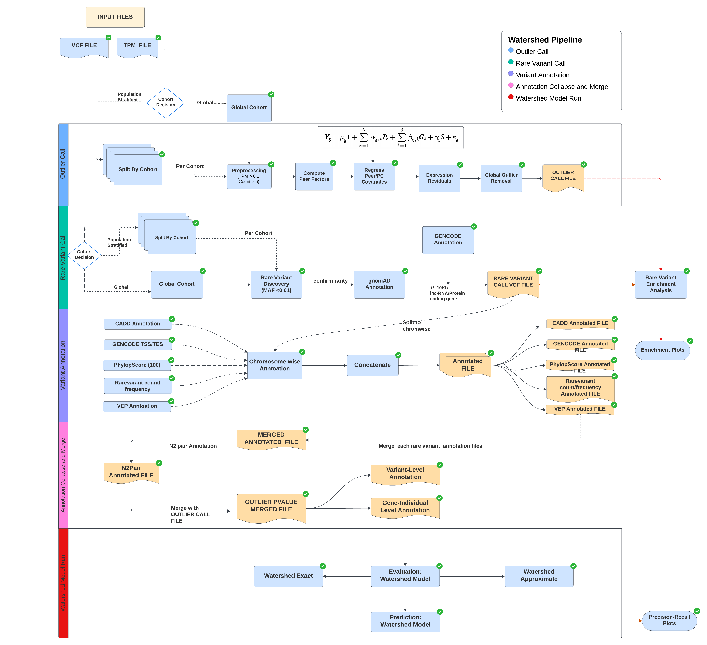

# Watershed Pipeline Repo



# Watershed Pipeline Input Format

This document provides a detailed description of the input file formats required for the Nextflow watershed pipeline. Users must ensure that the input files conform to the specified formats to ensure proper execution of the pipeline. Below are the descriptions and formatting details for each of the five required input files:

## 1. TPM Input File (`tpm_infile`)

### Description
This file contains Transcripts Per Million (TPM) data from RNAseq processing. The data input is similar to the input for typical eQTL analysis.

### Format
- **File Type:** Tab-separated values (.tab)
- **Header:** The first row should contain sample names.
- **Columns:**
  - The first column should contain Ensembl gene IDs.
  - Subsequent columns should contain TPM values for each sample.

### Example
```
                    Sample1  Sample2  Sample3  Sample4
ENSG00000000003.15  0.123  0.456  0.789  0.012
ENSG00000000005.6   0.234  0.567  0.890  0.123
ENSG00000000419.14  0.345  0.678  0.901  0.234
ENSG00000000457.14  0.456  0.789  0.012  0.345
ENSG00000000460.17  0.567  0.890  0.123  0.456
ENSG00000000938.13  0.678  0.901  0.234  0.567
ENSG00000000971.16  0.789  0.012  0.345  0.678
ENSG00000001036.14  0.890  0.123  0.456  0.789
ENSG00000001084.13  0.901  0.234  0.567  0.890
```

## 2. Read Count Input File (`readcount_infile`)

### Description
This file contains read count data from RNAseq processing, providing raw counts used in differential expression analysis.

### Format
- **File Type:** Tab-separated values (.tab)
- **Header:** The first row should contain sample names.
- **Columns:**
  - The first column should contain Ensembl gene IDs.
  - Subsequent columns should contain read count values for each sample.

### Example
```
                    Sample1  Sample2  Sample3  Sample4
ENSG00000000003.15  10  20  30  40
ENSG00000000005.6   15  25  35  45
ENSG00000000419.14  20  30  40  50
ENSG00000000457.14  25  35  45  55
ENSG00000000460.17  30  40  50  60
ENSG00000000938.13  35  45  55  65
ENSG00000000971.16  40  50  60  70
ENSG00000001036.14  45  55  65  75
ENSG00000001084.13  50  60  70  80
```

## 3. Covariate Input File (`covariate_infile`)

### Description
This file contains covariate data such as sex, principal components (PCs), and other potential confounders.

### Format
- **File Type:** Tab-separated values (.tab/.tsv or .gz)
- **Header:** The first row should contain sample names.
- **Columns:**
  - The first column should contain covariate IDs.
  - Subsequent columns should contain covariate values for each sample.

### Example
```
id  Sample1  Sample2  Sample3  Sample4
sex  XY  XX  XY  XY
PC1  -0.001  -0.002  -0.003  -0.004
PC2  0.001  0.002  0.003  0.004
PC3  -0.005  -0.006  -0.007  -0.008
PC4  0.005  0.006  0.007  0.008
PC5  -0.009  -0.010  -0.011  -0.012
PEER1  -0.013  0.014  0.015  -0.016
PEER2  0.017  0.018  0.019  -0.020
PEER3  -0.021  -0.022  -0.023  0.024
PEER4  0.025  0.026  -0.027  0.028
PEER5  -0.029  -0.030  -0.031  -0.032
PEER6  0.033  -0.034  0.035  -0.036
PEER7  0.037  -0.038  0.039  0.040
PEER8  0.041  0.042  0.043  -0.044
```

## 4. Subject IDs File (`subjids_file`)

### Description
This file contains the subject IDs along with their population ancestry.

### Format
- **File Type:** Text file (.txt)
- **Columns:**
  - The first column should contain subject IDs.
  - The second column should contain a single population ancestry (e.g., EUR, AFR, EAS, SAS, GLOBAL).

### Example
```
Sample1  EUR
Sample2  EUR
Sample3  EUR
Sample4  EUR
Sample5  EUR
```

## 5. Rare Variant Calling VCF File (`rv_file`)

### Description
This file contains variant data in VCF (Variant Call Format) for rare variant calling, including genotypic information for each sample.

### Format
- **File Type:** VCF (.vcf.gz)
- **Header:** The VCF header lines start with `#` and include metadata. The last header line contains column names.
- **Columns:**
  - `#CHROM`: Chromosome number
  - `POS`: Position on the chromosome
  - `ID`: Variant identifier
  - `REF`: Reference allele
  - `ALT`: Alternate allele
  - `QUAL`: Quality score
  - `FILTER`: Filter status
  - `INFO`: Additional information
  - `FORMAT`: Format of the genotype fields
  - Sample columns containing genotypic data

### Example
```
#CHROM  POS     ID      REF     ALT     QUAL    FILTER  INFO    FORMAT  Sample1 Sample2 Sample3 Sample4
1       10000   rs0001  A       G       99.9    PASS    .       GT      0|0     0|1     1|1     0|0
1       20000   rs0002  C       T       99.8    PASS    .       GT      0|0     1|1     0|1     0|0
1       30000   rs0003  G       A       99.7    PASS    .       GT      1|1     0|0     0|1     1|1
1       40000   rs0004  T       C       99.6    PASS    .       GT      0|1     1|0     1|1     0|1
1       50000   rs0005  A       C       99.5    PASS    .       GT      0|0     0|0     1|0     1|1
```

## Running the Nextflow Pipeline

### Command
To run the Nextflow pipeline with the correct Conda environment and a specific run name for resuming, use the following command:

```bash
nextflow run ./main.nf -c nextflow.config \
  --ancestry GLOBAL \
  --bin_dir "$BIN_DIR" \
  --cache_dir "$CACHE_DIR" \
  --watershed_pyenv "$CONDA_PYENV_YML" \
  --watershed_renv "$CONDA_RENV_YML" \
  --watershed_caddenv "$CONDA_CADDENV_YML" \
  --watershed_env "$CONDA_ENV_YML" \
  --genotype_pcs 5 \
  --skip_cache \
  --cachedir_vep "$VEP_CACHEDIR" \
  --tpm_infile "<path_to_tpm_infile>" \
  --readcount_infile "<path_to_readcount_infile>" \
  --covariate_infile "<path_to_covariate_infile>" \
  --subjids_file "<path_to_subjids_file>" \
  --rv_file "<path_to_rv_file>" \
  --tissue "LCL" \
  -profile conda \
  -resume
```

### Parameters
- `--tpm_infile`: Path to the TPM input file.
- `--readcount_infile`: Path to the read count input file.
- `--covariate_infile`: Path to the covariate input file.
- `--subjids_file`: Path to the subject IDs file.
- `--rv_file`: Path to the vcf file for rare variant call.

Replace `<path_to_tpm_infile>`, `<path_to_readcount_infile>`, `<path_to_covariate_infile>`, `<path_to_subjids_file>`, and `<path_to_rv_file>` with the actual paths to your respective input files.
```
